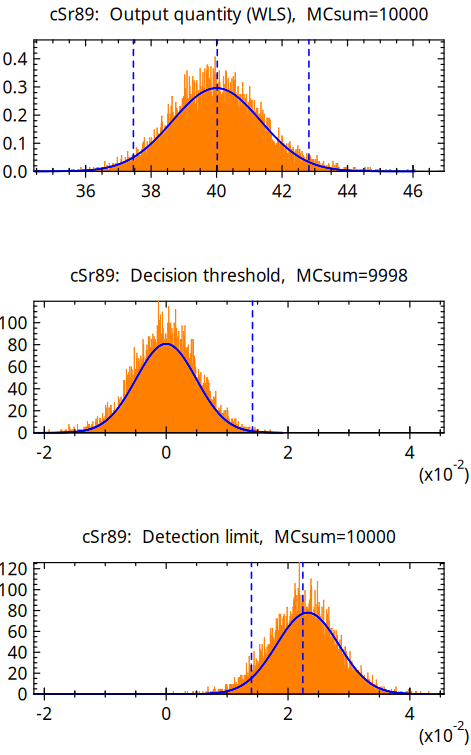

# UncertRadio
<small>([english version](README.md))</small>
## Software zur Berechnung charakteristischer Grenzen nach ISO 11929 für Aktivitätsmessungen

Die Software **UncertRadio** ermöglicht die automatisierte Berechnung der charakteristischen
Grenzen einer Aktivitätsbestimmung entsprechend
DIN ISO 11929. Im Detail werden die
Aktivitätskonzentration bzw. die spezifische Aktivität mit der dazugehörigen
kombinierten Standardmessunsicherheit, ihrem Unsicherheiten-Budget und den Werten
der Erkennungsgrenze und der Nachweisgrenze ermittelt. Die Unsicherheiten der
einzelnen Ergebnisgrößen werden nach ISO GUM mithilfe einer numerisch durchgeführten
Fortpflanzung der Unsicherheiten der Eingangsgrößen berechnet.

**UncertRadio** lässt sich für vielfältige Anwendungen
der Alpha-, Beta- und Gammamessung, aber auch der
Dosimetrie einsetzen. Die Software kann die charakteristischen Grenzen
simultan für bis zu drei Radionuklide zu ermitteln, deren Ergebniswerte,
z.B. Aktivitätsmesswerte, durch das Messverfahren bedingt voneinander abhängig sind.
Es ist auch für die Auswertung bei modernen Verfahren der Flüssigkeitsszintillationsmessung von z.B. Strontium-Isotopen verwendbar.

Die Software unterscheidet zwei mögliche analytische Ansätze, die sich in den Gleichungen zur Auswertung unterscheiden:

- Verfahren ohne lineare Entfaltung: die Grundgleichung ist linear in nur einer (verfahrensbezogenen) Nettozählrate (Kanisch, 2016a),

- Verfahren mit linearer Entfaltung: die Gleichungen verwenden zusätzlich ein lineares
Least-squares-Verfahren für z.B. Abkling- oder Aufbaukurven mehrerer Zählraten (Kanisch, 2016b).

Alternativ kann die Auswertung für beide Varianten auch mithilfe der Monte Carlo-Simulation erfolgen.
Dies entspricht einer Unsicherheits-Fortpflanzung ganzer Verteilungen nach
GUM Supplements 1 und 2 und ist dann im Vorteil, wenn die Verteilung der Ergebnisgröße
deutlich von der einer Normalverteilung abweicht.

Das bedeutet allerdings auch, dass der Nutzer die erforderlichen Gleichungen
zur Auswertung formulieren können muss. Ein besonderer Vorteil ist jedoch, dass
keine partiellen Ableitungen einzugeben sind. Zum besseren Verständnis der
Datenhandhabung innerhalb der Software und der hinterlegten Gleichungen und
Funktionen ist eine umfangreiche Sammlung von Anwendungsbeispielen als Projektdateien beigefügt.

Viele der Anwendungsbeispiele stammen aus der Arbeitsgruppe "AK-SIGMA" des
"Fachverbandes für Strahlenschutz", den Messanleitungen der Leitstellen und
aus der Literatur. Diese Beispiele haben, ebenso wie die im Beiblatt 1 zur
DIN ISO 11929 (2014) und die in der neueren ISO 11929-4 genannten Beispiele,
wesentlich zur Validierung von **UncertRadio** beigetragen.

An dieser Stelle sei den Anwendern, vor allem aus den in der Überwachung
der Umweltradioaktivität nach AVV-IMIS tätigen Kreisen der Leitstellen
und Messstellen, gedankt. Sie haben durch ihre Rückmeldungen oder durch neue
Anforderungen wesentlich zur Weiterentwicklung von **UncertRadio** und seiner
praktischen Anwendbarkeit beigetragen.

Die aktuell bereitgestellte Version ist die 2.5.1.

Seit der Version 2.5.1 steht der Quellcode online zur Einsicht zur Verfügung und kann aus
den Quellen erstellt werden. Eine entsprechende Anleitung findet sich weiter unten.
Für Windows werden weiterhin vorkompilierte Pakete bereitgestellt. Diese bestehen
aus einem gepackten Archiv mit allen benötigten Datein. Dieses muss zur Nutzung nur
entpackt werden. Im Anschluss kann das Programm mit der "UncertRatio.exe" Datei im
Unterverzeichnis "bin/" gestartet werden.

Die Version 2.4.32 ist die letzte Version, die mit einem Windows-Installationsprogram
bereitgestellt wurde.

Von Version 2.1.4 bis 2.4.32 bestand der Download aus einer ausführbaren Installationsdatei.
Sie enthielt alle benötigten Komponenten, einschließlich einer Windows-Hilfe,
einer Kurzanleitung für die Installation und eine Sammlung von Anwendungsbeispielen.
Zusätzlich kann eine Übersicht über den Aufbau der wichtigsten Programmdialoge
der Software heruntergeladen werden.

Seit der Version 1.08 (2013) kann **UncertRadio** zudem als Schnittstelle zwischen
der Software zur Erfassung der Messwerte und der Übergabe der charakteristischen
Werte in ein modernes Laborinformationssystem verwendet werden. Dazu wird das
csv-Format für den Daten-Import und –Export genutzt.

Der Autor des Programms ist Günter Kanisch. Ansprechpartner für Fragen und Anregungen
ist Dr. Marc-Oliver Aust von der "Leitstelle für Fisch und Fischereierzeugnisse,
Krustentiere, Schalentiere, Meereswasserpflanzen" im Thünen-Institut für Fischereiökologie.

**WICHTIGER HINWEIS:**

**UncertRadio** ist Freie Software: Sie können es unter den Bedingungen
der GNU General Public License, wie von der Free Software Foundation,
Version 3 der Lizenz oder (nach Ihrer Wahl) jeder späteren
veröffentlichten Version, weiterverbreiten und/oder modifizieren.

**UncertRadio** wird in der Hoffnung, dass es nützlich sein wird, aber
OHNE JEDE GEWÄHRLEISTUNG, bereitgestellt; sogar ohne die implizite
Gewährleistung der MARKTFÄHIGKEIT oder EIGNUNG FÜR EINEN BESTIMMTEN ZWECK.
Siehe die GNU General Public License für weitere Details.

Sie sollten eine Kopie der GNU General Public License zusammen mit diesem
Programm erhalten haben. Wenn nicht, siehe <https://www.gnu.org/licenses/>.

Das Programm wurde vom Autor nach derzeitigem Stand von Wissenschaft,
Normung und Technik entwickelt und bezüglich der Richtigkeit der mathematischen Behandlung
der eingegebenen Modell-Gleichungen validiert.
Trotzdem wird vom Autor, vom TI und vom BMUV keine Gewährleistung für die Richtigkeit der damit vom Anwender
erzielten Ergebnisse gegeben und keine Haftung für daraus resultierende Ansprüche Dritter übernommen.

Zitertationshinweise können [hier](README.md#how-to-cite) gefunden werden.

Eine ausführliche [Installationsanleitung](README.md#how-to-build-uncertradio) und
weiterführende Informationen sind auf der [GitHub Seite](https://github.com/OpenBfS/UncertRadio)
des Projekts zu finden. Das Team freut sich über Hinweise und Unterstützung.