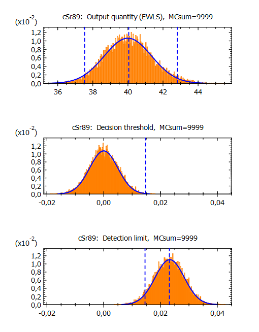

[](https://joss.theoj.org/papers/cd580ee1d2dda58267edc892c8430114)
# UncertRadio
<small>([german version](README.de.md))</small>
## Software for determining characteristic limits in accordance to ISO 11929 for radioactivity measurements

The software **UncertRadio** enables the automated calculation of characteristic
threshold values of activity mesurements according to ISO 11929.
These include the activity concentration or specific activity and its combined
standard measurement uncertainty, an uncertainty budget and values of
decision threshold and the detection limit.
The uncertainties of the single output values are calculated using
numerical error propagation according to ISO GUM.

**UncertRadio** can be used for a variety of applications from Alpha, Beta and
Gamma measurements, but also from dosimetry. It has the capability to derive
the characteristic values for up to three radionuclides simultaneously, whose
output quantity values, e.g. activity values, of which are dependent from each
other due to the measurement. Therefore, it is especially suited for modern
liquid scintillation measurement procedures of e.g. Strontium isotopes.



There are two main analytical approaches used within the software
differing by the equations for the evaluation:

- procedures without linear unfolding: the basic evaluation model is linear in
the net count rate; numerically applied propagation of uncertainty
values of input quantities (Kanisch, 2016a),

- procedures with linear unfolding: the model in addition includes linear least squares
procedures for fitting e.g. for decay or build-up curves (Kanisch, 2016b).


Alternatively, an evaluation by Monte Carlo simulation may be used within
both approaches. This represents the method of propagating whole distributions
and is in advantage in the case of significant deviations from the normal
distribution; see ISO GUM Supplements 1 and 2.

Applying **UncertRadio** means that the user should be able to formulate the
equations used for the calculating values of the output quantity. A special
advantage is, however, that no partial derivatives are to be supplied. For a
better understanding of the course of the software and of user-supplied
equations and functions an extensive bundle of application examples as project
files is included into the installation.

Many of the application examples are from the working group "AK-SIGMA" of the
"German-Suisse Association for Radiation Protection", from Measuring
Instructions of the German Co-ordinating Offices and from the literature.
These examples including those of a German National Supplement 1 of DIN ISO
11929 (2014) as well as the examples from the more recent
standard ISO 11929-4 contributed to the validation of **UncertRadio**.

The UncertRadio HTML documentation is included in every release and can be accessed offline using
the help buttons. Furthermore, it is available online on [GitHub Pages](https://openbfs.github.io/UncertRadio/).

The author is grateful for the feedback and new requirements of the user-community,
especially from federal coordination centres and the laboratiories of the
German Federal States working after AVV-IMIS on monitoring of environmental
radioavitiy, and significantly improved the quality and usability of **UncertRadio**.

The actual version is 2.6.2.

Since version 2.5.1, the source code is available online and **UncertRadio** can be
created from the sources. The associated installation guide is given below.
Pre-compiled packages are still provided for Windows. These consist of a packed
archive containing all required files. After unpacking, the program can be started
with the "UncertRatio.exe" found within the "bin/" subdirectory.

Version 2.4.32 is the last version that can be installed with an installation program
for Windows.

From version 2.1.4 (2017) to 2.4.32 the download consisted of one executable file, which
combines all required components of the Software (help-files, short installation
guide, collection of validated example projects). Additionally, a brief instruction
to use the software was provided for download. The private or commercial use of the
software is free of charge.

Since version 1.08 (2013) **UncertRadio** can be used as an interface between
the software for acquiring measurement data and the transfer of characteristic
values into a modern laboratory information system. The csv format is used for
data import and export.

The program's author is Günter Kanisch. Contact person for questions and
suggestions is Dr. Marc-Oliver Aust from the "Federal co-ordinating Office
for fish and fishery products, crustaceans, mollusks and marine algae" in
the Thünen-Institute of Fisheries Ecology.

**Important Note:**

**UncertRadio** is free software: you can redistribute it and/or modify
it under the terms of the GNU General Public License as published by
the Free Software Foundation, either version 3 of the License, or
(at your option) any later version.

**UncertRadio** is distributed in the hope that it will be useful,
but WITHOUT ANY WARRANTY; without even the implied warranty of
MERCHANTABILITY or FITNESS FOR A PARTICULAR PURPOSE. See the
GNU General Public License for more details.

You should have received a copy of the GNU General Public License
along with **UncertRadio**. If not, see <http://www.gnu.org/licenses/>.

The software was developed by the author following state-of-the-art of science,
standardization and technology and validated with respect to the correct mathematical
treatment of the model input equations of the evaluation model.
Nevertheless, no warranty is given for the correctness of results obtained by the user working with
**UncertRadio**, neither by the author nor by TI and BMUV, and no responsibility
is taken for emerging demands by any third party.

## How to cite
If you are using **UncertRadio**, please consider citing the following papers:

```text
KANISCH, G.; OBER, F.; Aust, M.O.: **UncertRadio**: Software for determining characteristic limits in accordance to DIN EN ISO 11929 for radioactivity measurements
Journal of Open Source Software (JOSS), see above

KANISCH, G.: Generalized evaluation of environmental radioactivity measurements with UncertRadio. Part I: Methods without linear unfolding.
Appl. Radiat. Isot. 110, 2016, 28–41
http://dx.doi.org/10.1016/j.apradiso.2015.12.003

KANISCH, G.: Generalized evaluation of environmental radioactivity measurements with UncertRadio. Part II: Methods with linear unfolding.
Appl. Radiat. Isot. 110, 2016, 74–86
http://dx.doi.org/10.1016/j.apradiso.2015.12.046
```

## How to build UncertRadio
### Requirements for Windows
Download and install MSYS2 at https://www.msys2.org/

Start the MSYS2 UCRT64 environment and update the system
```bash
pacman -Syuu
```
Restart the MSYS2 UCRT64 terminal if required

Install required tools and programms
```bash
pacman -S git make mingw-w64-ucrt-x86_64-cmake mingw-w64-ucrt-x86_64-toolchain mingw-w64-ucrt-x86_64-gcc-fortran mingw-w64-ucrt-x86_64-gtk3 mingw-w64-ucrt-x86_64-plplot mingw-w64-ucrt-x86_64-wxwidgets3.2-msw mingw-w64-ucrt-x86_64-lapack mingw-w64-ucrt-x86_64-python-sphinx mingw-w64-ucrt-x86_64-python-myst-parser
```
**Please note:**

We switched to the UCRT64 environment as [suggested](https://www.msys2.org/docs/environments/) by MSYS2.
Compiling UncertRadio using the MINGW64 environment should work when using the `-G "MinGW Makefiles"` switch. Nonetheless, you need to install the corresponding programs with `pacman -S ...`.

### Requirements for Linux

Please make sure you have installed the following tools including the development files:

- git
- cmake
- gcc-fortran (and corresponding gcc-toolchain)
- lapack
- gtk3
- plplot ([see](https://plplot.sourceforge.net/documentation.php)), make sure the fortran bindings are included and the cairo driver is installed

To build the documentation, the following additional tools are required:
- python3
- python-sphinx >= 8.0
- myst-parser

Most of these tools are available via the package manager of common Linux distributions.

We were able to successfully compile **UncertRadio** using the following distributions:
 - Arch linux
   ```bash
   pacman -Syu
   pacman -S base-devel git cmake gcc-fortran lapack gtk3 python-sphinx python-myst-parser
   ```
   **Note:**
   Arch linux is not providing plplot in their repositories.
   Thus, you have to compile it from the [source](https://plplot.sourceforge.net/documentation.php).
   You also could use the [AUR package](https://aur.archlinux.org/packages/plplot). Please read and understand the official information about the potential dangers of using software from the [AUR](https://wiki.archlinux.org/title/Arch_User_Repository):
   ```bash
   git clone https://aur.archlinux.org/plplot.git
   cd plplot
   makepkg -si
   ```
   
 - Debian 13 (trixie)
    ```bash
   apt-get update && apt-get upgrade
   apt-get install build-essential gfortran git libgtk-3-dev libplplot-dev plplot-driver-cairo liblapack-dev python3-sphinx python3-myst-parser
   ```

 - Debian 12 (bookworm)
   ```bash
   apt-get update && apt-get upgrade
   apt-get install build-essential gfortran git libgtk-3-dev libplplot-dev plplot-driver-cairo liblapack-dev
   ```

    **Note:**
    To build the documentation under Debian 12, you must install `python-sphinx` via pip, as the system's version is too old.
    It is recommended to use a virtual environment:

    ```bash
    # Install pip and python venv
    apt-get install python3-pip python3.11-venv
    # Create and activate the virtual environment
    python3 -m venv venv
    source venv/bin/activate
    # Install the required packages
    pip install -r docs/requirements.txt

    # Optional build the documentation directly
    cd docs
    python3 make_docs.py

    ```

### Actually build UncertRadio

Clone the repository:
```bash
git clone https://github.com/OpenBfS/UncertRadio.git
```

Now it should be possible to build UncertRadio.
```bash
cd UncertRadio
cmake -B build -DCMAKE_BUILD_TYPE=Release
cmake --build build -j4

```
The `-DCMAKE_BUILD_TYPE` switch can be omitted to compile UR in `debug` mode.
When using the MSYS2 MINGW64 environment you have to change the generator using
`-G "MinGW Makefiles"`, due to a gtk3-fortran
[issue](https://github.com/vmagnin/gtk-fortran/issues/292):

```bash
cmake -B build -DCMAKE_BUILD_TYPE=Release -G "MinGW Makefiles"
```

#### Install UncertRadio (mainly intended for Windows)
The directory can be changed using the --prefix option:

```bash
cmake --install build --prefix=UR2_6
```

Create an archive to distribute UncertRadio:

```bash
tar -czvf UR2_6.tar.gz UR2_6
```

#### Update
To get the latest version just update the main branch

```bash
git checkout main
git pull
```
Now restart the build and install process (see above).

#### Build the Documentation
The UncertRadio HTML documentation is available online on [GitHub Pages](https://openbfs.github.io/UncertRadio/).
However, it can be built from the source files in two ways. The easiest way is to include the
cmake option `BUILD_DOCS=T` and build the documentation together with the code.

```bash
cmake -B build -DBUILD_DOCS=T -DCMAKE_BUILD_TYPE=Release
```

However, you can build it on its own by running the `make_docs.py` file in the `docs` folder:
```bash
cd docs
python make_docs.py
```
### Starting UncertRadio

After running the install command, UncertRadio can be started by running
the executable in the created `bin` directory:

```bash
./UR2_6/bin/UncertRadio.exe
```

Otherwise using linux, the install step can be skiped and UncertRadio can be started with the executable
within the main directory of the repository:

```bash
./UncertRadio
```

### Running the included tests

There are about 70 examples in German and English language included
in the pros directory. To check if UncertRadio is running correctly,
you can start its included testsuite by selecting "Options/QC batch test" from the main menue.
By default, it opens all the included projects (defined in the included `BatListRef_v06.txt`)
and compares their results. By default (and on the first start of this dialog), the file is already selected.
The file for the output file can be left empty. UncertRadio will create an output file automatically.
Any deviations that may occur are reported.

In addition, all project tests mentioned above and some more internal tests can be run from the command line.

```bash
./UncertRadio run_tests
```

To get a better understandig about the project structure, all projects can be individually
accessed through the 'Open Project' dialog, which is accessible via the main
menu or the 'Load Project' icon. For most of the projects, the expected results are
included in the description tab.

## To be done

- [x] carefully correct all (old) Licence informations
  - [x] add the licenses of the included libraries
  - [x] add a license for UR2

- [x] translate the README to english

- [x] add linux compilation instructions

- [x] add a JOSS Paper draft (see paper branch)

- [x] check all included examples

- [x] create automatic tests (partly done, run: `./UncertRadio run_tests`)

- [x] create a sphinx documentation and migrate the (Windows-chm) help files

- [ ] translate the documentatation (partly done)

- [x] publish the documentation online

- [ ] create an automatic building and upload system for Windows binaries

- [ ] update the function parser to a potentially faster version

- [ ] refactor the logging system (there are still unopened files)

- [ ] provide linux binaries (as AppImage or Flatpak?)

- [ ] remove not used and not initiated variables

- [x] refactor and simplify the complete translation

- [ ] separate GUI and backend (see gtk3-fortran branch)

## Known issues

You tell us ;) -> please use the [issue tab](https://github.com/OpenBfS/UncertRadio/issues) or create a [pull](https://github.com/OpenBfS/UncertRadio/pulls) request. We are grateful for every help. Please get involved.
