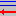

Handling the individual TABs
============================

TAB “Procedure”
---------------

The measurement problem to be considered can be characterized here by a
short description of the method`s principle and special characteristics
may be pointed at. Cited literature may also be included. If the project
is under development regarding the equations, this TAB may be skipped.

When the text input is finished one may change by mouse click to the TAB
“Equations”.

TAB “Equations”
---------------

1) One must begin with the first enabled ASCII text field (the
uppermost, the only one enabled when beginning with a new project), in
which equations are to be inserted line-by-line: `Text field for
equations <#text-field-for-equations>`__

2) If all equations have been given formula symbols are extracted from
them by clicking the **button** **"Load symbols(1) from equations"**,
followed by a syntax check using the internal function parser and the
symbols are loaded into a table which then may be edited and values in
the columns *Unit* and *Meaning* may be added.

   After having edited the equations, the following cases may occur
   regarding already existing symbols:

   a. New symbols have been introduced. The corresponding symbol table
   rows are green colored.

   b. Already defined symbols are no longer needed (**dispensable
   symbols**). The corresponding symbol table rows are put to the end of
   the table being yellow colored.

   The yellow-colored table rows must at first be marked/selected with
   the mouse; then, they are removed using the toolbar icon **„delete rows“**
   |delete_rows_icon|.
   Some symbols, not directly used within the
   equations, but still needed (e. g., counting durations), must not be
   deleted.

For further editing: see `Edit symbol list <#editing-the-symbol-list>`__

For such quantities within the symbol list, for which mean and variance
are be determined from an associated data set, the value “m“ is set in
the column “type“ instead of “a“ (dependent quantity) or “u“
(independent quantity). Furthermore, if a quantity, to be calculated by
an equation, shall be used as a parameter without uncertainty, the type
value “p“ can be used.

1) After the symbol list has been completed (in the testing phase units
and meanings need not yet to be defined) by a mouse click on the
**button “Load symbols(2) of the finalized symbol table”** the complete
symbol list is loaded for the calculations to be done.

4) Now, the two **selection fields** “\ **Net count rate**\ ” and
“\ **Gross count rate**\ ” are enabled. They allow selecting the
appropriate symbols for the net counting rate and the gross counting
rate. For the further course through the program **these selections are
only of interest to the calculations of Decision threshold and Detection
limit**. After having selected them they have to be loaded by clicking
the button “Accept net and gross count rates”.

If more than one output quantity is defined, those symbols for the net
and gross counting rate must be chosen belonging to the actually active
output quantity.

Note: The identification of the net counting rate (more precisely: of
the `procedure dependent net counting rate <#numerical-procedures>`__)
is needed to allow within the iteration for the Detection limit a simple
numerical inversion of the equations, from the varied output quantity
(e.g. activity in Bq/kg wet weight) back to the net counting rate (in
:math:`s^{- 1}`). The gross count rate symbol must be identified because
the user has to supply the uncertainty function for it; for the
determination of Decision threshold and Detection limit the value of the
gross count rate is varied internally where this uncertainty function is
then used to calculate its associated modified uncertainty value.

**Exceptions:**

   a) in the analysis of a decay curve with linear Least squares fitting
   (calling **Linfit**) **the indication of a gross counting rates is
   not required**;

   b) similarly, in the case of estimating a mean of activities from
   individual gamma lines of a radionuclide (calling **Gamspk1**); the
   **selection of the gross counting rate is inapplicable**; the **net
   counting rate**, however, **has to be selected** **because it acts as
   placeholder for the source activity (Bq);**

   c) when summing up or averaging several aliquot measurements (calling
   **SumEval**)

   With these exception cases the symbol to be selected as net counting
   rate (or the source activity in the case of *Gamspk1*) must be that
   one which is defined in the equations by the call to *Linfit* or to
   *Gamspk1*.

5) After step 4 the TAB has been successfully treated and the next TAB
to be treated, “Values, uncertainties” is enabled and selected then by a
mouse click.

TAB “Values, Uncertainties”
---------------------------

A major part of this TAB consists of a 10-column table for the input of
measurement values and uncertainties of the independent measured
quantities (input quantities). The columns are:

.. list-table::
    :widths: auto
    :header-rows: 0

    * - 1:
      - **Symbol**
      - text field
      - formula symbol

    * - 2:
      - **Type**
      - text field
      - Parameter type: **a** for dependent, **u** for independent,
        **m** for a quantity mean, **p**
        for a parameter to be calculated, without uncertainty

    * - 3:
      - **Unit**
      - text field
      - input of unit

    * - 4:
      - **Value**
      - number field
      - value of measured quantity

    * - 5:
      - **distribut.**
      - select. field
      - selection of the quantity`s distribution
        (normal / rectangular / triangular / others)
        The `(N+x) rule for very low count numbers <#low-level-applications-nx-rule>`__
        may be selected here, implying Gamma distributions of the associated
        counting rate variables

    * - 6:
      - **StdDev formula**
      - text field
      - formula of the standard deviation of the quantity;
        no formula if (N+x) rule has been selected;
        (the internal coverage factor is always 1);
        always "." has to used for the decimal point

    * - 7:
      - **StdDev value**
      - number field
      - value of the uncertainty for normal distribution
        if the (N+x) rule has been selected, **nothing** shall be entered
        these cells!(the internal coverage factor is always 1)

    * - 8:
      - **Half width**
      - number field
      - Half width of rectangular/triangular distribution
        (the internal coverage factor is always 1)

    * - 9:
      - **abs./rel.**
      - select. field
      - select whether the uncertainty from col. Sp. 6, 7 or 8
        are to be taken *absolute* or as *relative* value.

    * - 10:
      - **abs. std. Unc.**
      - number field
      - (combined) absolute standard uncertainty
        calculated by the program form the values of the columns 6, 7, 8 and 9;
        Note: a value entered by the user will always
        be over-written by the program!

The columns 1 to 3 have been taken from the preceding symbol list and
are disabled here.

For the user’s support **those cells in the table are colored with red
background which are not filled in by the user**: these are cells
belonging to dependent quantities. Only cells with white background
should be used for direct input by the user. That means, the rows
belonging to dependent quantities are found in the uppermost part of the
table, **the first row (row 1) is the one for the output quantity, or
the rows 1-3 in the case of three output quantities**.

Special feature of non-normal distributed numbers of counts and count
rates: `see <#treatment-of-numbers-of-counts-and-count-rates>`__.

For a data set-based quantity, mean and uncertainty are calculated
internally from the associated data set and transferred to the “values,
uncertainties” table with the button “Calculation of uncertainties”. The
corresponding rows in that table therefore have also a red colored
background.

The “white cells” in columns 4 to 9 must be filled in by the user.
**Numerical values must be input into the column “value”** while this is
not always necessary in columns 6 to 9 for each of the quantities. One
can often abstain from giving uncertainties, for instance for counting
times. The input of uncertainties is allowed in only one of the columns
6, 7 or 8. The selectable field “abs./rel.” however must be used, if in
the columns 6 to 8 an entry exists.

For counting rates or numbers of counts **the standard deviation can be
input as a formula** in column 6 (“StdDev formula”) - without preceding
equal sign. For **quantities declared as normal distributed** - also
possible for counting rates/numbers of counts - the numerical value of
the uncertainty is input in column 7 (“StdDev value”). In the case of
**rectangular and triangular distributed quantities** the uncertainty is
characterized by the value of the half-width in column 8. The latter
value is internally converted to a standard deviation (normal
distribution) according to the GUM rules which then is transferred to
the cell in column 10 (“abs. std.Unc.”).

**One cell** within the column “StdDev formula” **is** **highlighted by
green colour.** Here, the **standard deviation formula of the gross
counting rate** must be given. This formula is required later for the
numerical-iterative calculation of the Decision threshold and the
Detection limit. It is considered as **“uncertainty function” of the
gross counting rate (and implicitly of the (procedure dependent) net
counting rate)** **which allows estimating its uncertainty for any
varied (iterated) value of the gross counting rate.** It has, however,
no meaning for the calculation of the combined uncertainty of the output
quantity.

**Possible formulae of the standard deviation of the gross counting rate
Rg** (incomplete):

sqrt(Rg/tm) counting devices (counting time tm), single measurement

sqrt(Rg/tm/n) counting devices (counting time tm), n-times repeated
measurement

sqrt(Rg/2/tau) ratemeter measurements (time constant tau)

If in addition to the gross count rate Rg the **gross count number Ng**
is also used, e.g., by defining an equation Rg=Ng/tm, one should have in
mind that **the program also modifies Ng if Rg** **is modified**. From
this equation, Rg=Ng/tm, UncertRadio can identify the count number Ng
belonging to Rg. This ensures, that the program, during evaluating the
equations from the bottom upwards (Ng then is an independent quantity
and Rg is dependent), does not overwrite the Rg value and its
uncertainty primarily modified, by re-calculating Rg and its uncertainty
from Ng and its uncertainty, if the latter would not have been modified
also.

If the values of the **gross count rate Rg is obtained as a mean of
several individual values,** a linear interpolation is necessary between
its variance at measurement (u_Rgm^2) and the variance to be used for
calculating the decision threshold (u_R0^2). The formula for the
standard uncertainty may be expressed as:

.. math::
    :label: eq:std_uncertainty

    \sqrt{u(R_{0})^{2} + (u(R_g)^2 – u(R_{0})^{2})*(R_{g} - R_{0}) / (R_{gm} – R_{0})}

Herein, Rg und Rgm are the modified (varied) and the measured value of
the gross count rate, respectively. If Rg takes the upper value, Rgm,
the result is sqrt(u_Rbm^2), while the result is sqrt(u_R0^2) for the
lower value Rg=R0. This requires appending the symbols Rgm, u_Rgm and
u_R0 to the symbol list (TAB “Equations”) of independent quantities.
They do not get an uncertainty and their values are to be given
explicitly in the “Values, uncertainties” table.

**Note:**
Since the program version 2.3.05 2020/01 it is no longer necessary that
the user supplies the equations :eq`std_uncertainty` or a similar formula to UncertRadio.
The introduction of additional auxiliary quantities also can be omitted.
The chapter 6.9 generally informs how to supply datasets for calculating
means. Based on that, the chapter 6.12 describes the necessary
calculations and manipulations within the program for deriving an
extended version of equation (1).

The type of equation (1) for the uncertainty of the gross count
rate-related mean depends on how the mean of single values suffers by
additional random influences, which can be characterized as **unknown**
or **known**. According to these two options, different versions of Eq.
(1) are applied. This is also considered in chapter 6.12, where
corresponding example projects are also indicated.

It may happen with special measurement problems that the length of the
standard deviation formula of the gross counting rate is longer than the
visible part of that cell. For better editing, one can then copy this
formula by copy and paste (in the mouse context menu) from this cell to
the longer text cell (“\ **extra working cell for formulae editing**\ ”)
located above the table and back again.

Below the uncertainty table is located a smaller **table for the input
of covariances**. Its columns are as follows:

.. list-table::
    :widths: auto

    * - 1:
      - **Symbol A**
      - symbol list box for quantity A
    * - 2:
      - **Symbol A**
      - symbol list box for quantity B
    * - 3:
      - **Type**
      - list box for choosing input between covariance and
        correlation coefficient
    * - 4:
      - **Formula**
      - text field for defining the covariance as formula
        being a function of already defined symbols
    * - 5:
      - **(or) Value**
      - number field for input of the value of the
        covariance / correlation coefficient

In the columns 1 and 2 the symbols of correlated measured quantities are
selected. After having selected “covariance” in column 3 a formula for
the covariance may be entered in the column “Formula”. Otherwise, a
numerical value of the covariance / correlation coefficient can be
entered directly into the column “(or) Value”.

Relation between correlation coefficient **r** and covariance **cov**:

:math:`r(SymbolA,\ SymbolB) = \frac{cov(SymbolA,\ SymbolB)}{\sqrt{var(SymbolA) \bullet var(SymbolB)}}`

Having completed the input to the uncertainty and to the covariance
tables a mouse click on the **button “calculation of uncertainties”**
will initiate the following calculations:

• Note: All calculations within this TAB and the following refer to
  the actually selected output quantity, if more than one output
  quantities have been defined for the project. Under the menu item
  “Edit – Select output quantity” another output quantity may be
  selected;
• **Uncertainty table**: values of dependent quantities (red colored
  fields) are calculated and inserted into the corresponding cells;
  Formulae for standard deviations in the column “StdDev formula” are
  evaluated; standard uncertainties of independent quantities are
  evaluated into column “abs. std.Unc.“;
• **Covariance table:** evaluation of covariance formulae as
  numerical values into column “(or) Value”;

• **Uncertainty table:** now all variances/covariances are known for
  the complete uncertainty propagation; calculation of the standard
  uncertainties of the dependent quantities (a) below the output
  quantity and of the output quantity (row 1 in that table); the
  combined standard deviations of the dependent quantities (red
  colored) are exclusively calculated from the
  uncertainties/covariances of the independent quantities (white
  colored).

**Only after finalisation of these calculations the TAB “Uncertainty
budget” is enabled.**

With more complex measurement problems and a more slowly PC it may be
that the calculations take few seconds; it is indicated in the **status
bar segment at the lower right corner of the UncertRadio window** with
the entry “calculating…” that is still working. After termination of the
calculations the entry within this field will be “Ready!”.

**Note:** `Implication of changing parameters within the Options
menu <#implication-of-changes-within-the-options-menu>`__

**For working with tables**: see `Menu Edit -
Table <#within-tables-delete-rows-working-with-column-blocks>`__

TAB “Uncertainty Budget”
------------------------

Under this being selected by mouse click the uncertainty budget is
presented as a table. The output quantity is indicated which this
uncertainty budget is referred to.

The **table “Uncertainty budget”** again contains the three columns
“Symbols”, “Type” and “Unit” already known.

The columns “Value” and “Std. uncertainty” contain the input values of
the measured value and its standard uncertainty of each of the
independent measurement quantities as well as of each dependent quantity
(auxiliary and output quantity).

In the column **“Sensitivity coefficient”** partial derivatives of the
function of the output quantity **y** (i.e., the function determined by
the equations with which the value of the output quantity is calculated)
are given for each independent quantity.

From the **products Uncertainty x Sensitivity coefficient**, the values
of which are shown in the next column, the uncertainty budget is deduced
in two different ways.

The column **“relat. contribut(%)“** shows for each independent symbol -
in case its uncertainty is non-zero - the relative contribution (in %)
of its variance to the total variance of the output quantity. This
column gives the information which of the (independent) quantities
contributes at most to the combined uncertainty of the output quantity.
The indication of 100% in this column for the output quantity is only
that the control sum of the individual relative contributions. Using the
**button “Change budget type”** allows to display absolute uncertainty
contributions in this column, given in the unit of the output quantity.

The preceding **definition of the “relat. contribut(%)“** to the
uncertainty budget **has got a further plausible meaning by the recent
publication by** **Kessel, Kacker and Berglund** (2006) with the title
“Coefficient of contribution to the combined standard uncertainty“:

   That relative contribution of an input quantity :math:`x_{i}`,
   divided by 100, is in the case of un-correlated input quantities
   identical with the square of the correlation coefficient between
   :math:`x_{i}` and the output quantity **y**! This quantity is now
   called “\ **coefficient of contribution”** and is represented by the
   symbol :math:`h\left( y,x_{i} \right)`.

The generalised definition of the “coefficient of contribution” is now:

:math:`h\left( y,x_{i} \right) = \frac{\left( \partial y/\partial x_{i} \right) \bullet u\left( x_{i} \right)}{u(y)} \bullet r\left( y,x_{i} \right)`
(1)

As we have for non-correlated input quantities:

:math:`r\left( y,x_{i} \right) = \frac{\left( \partial y/\partial x_{i} \right) \bullet u\left( x_{i} \right)}{u(y)}`
(2)

from Eq. (1) then follows Eq. (3), which was already known - for
non-correlated input quantities - as the positive relative contribution
to the variance of the output quantity:

:math:`h\left( y,x_{i} \right) = \left\lbrack \frac{\left( \partial y/\partial x_{i} \right) \bullet u\left( x_{i} \right)}{u(y)} \right\rbrack^{2}`
(3)

If correlations :math:`r\left( x_{i},x_{j} \right)` between input
quantities exist, they are inserted into Eq. (1) in the factor
:math:`r\left( y,x_{i} \right)` defined as follows:

:math:`r\left( y,x_{i} \right) = \sum_{j}^{}{\left\lbrack \frac{\left( \partial y/\partial x_{j} \right) \bullet u\left( x_{j} \right)}{u(y)} \right\rbrack \bullet \left\lbrack r\left( x_{i},x_{j} \right) \right\rbrack}`
(4)

Note that this may lead now in some cases to negative values of
:math:`h\left( y,x_{i} \right)`, the coefficient of contribution.

**Notes on effects from covariances:**

If covariances are considered for the calculation of uncertainties
negative values may occur in the column “relat. contribut(%)“; this is
not a program error.

According to the mentioned paper by Kessel et al. correlations
(covariances) between input quantities are considered according to Eq.
(1) in combination with Eq. (4) for calculating the “coefficient of
contribution” and resulting values presented in the column “relat.
contribut(%) in the uncertainty budget table. Eq. (3) then is no longer
valid.

With UncertRadio this procedure according to Kessel et al. is
implemented since version 0.05 (2007/11), i.e. the values shown in the
column “relat. contribut(%)“ of the uncertainty budget correspond to
this new definition. This may be demonstrated with the **example
projects** **Kessel-2a-2006.txp and Kessel-2b-2006.txp**, which were
prepared from two examples from that publication.

TAB “Results”
-------------

Under this TAB selected by mouse click the total result for the output
quantity is shown including further variables and the values of the
Decision threshold and the Detection limit. The output quantity is
indicated which this result is referring to.

These are in detail:

**the result of the measurement:**

-  the value of the output quantity

-  the expanded uncertainty, in the same unit as that of the output
      quantity

-  the relative expanded uncertainty (in %)

-  the coverage factor (can be modified in the **menu Options**)

`best estimates according to Bayes and confidence
limits <#best-estimates-according-to-bayes-and-confidence-limits>`__
**(see also ISO 11929:2019):**

-  the value of the output quantity

-  the expanded uncertainty

-  the value of the lower confidence limit

-  the value of the upper confidence limit

-  probability :math:`(1 - \gamma)` associated with the confidence
      interval

..

   The toggle button „min. Coverage interval“ can be used to switch the
   display between probabilistically symmetric and the shortest coverage
   intervals, also in the case of the MC-Simulation.

**Decision threshold and Detection limit:**

-  the value of the Decision threshold including the number of
      iterations (actually no iterations)

-  the value of the Detection limit including the number of iterations

-  the applied quantiles of the normal distribution,
      :math:`k_{1 - \alpha}` and k_beta = :math:`k_{1 - \beta}`,
      corresponding to the errors of first and second kind

**WLS, PLSQ, PMLE or WTLS: Standard uncertainties of the fitting
parameter corresponding to the output quantity from the analysis of
decay curve:**

-  the uncertainty obtained from the least squares analysis; it is
      **NOT** multiplied with :math:`\sqrt{\chi_{R}^{2}}` if the reduced
      Chi-squared value is larger than 1; this variant of the
      uncertainty of the net counting rate is used for estimating the
      uncertainty of the output quantity;

-  that value of the uncertainty of the output quantity which is
      obtained from uncertainty propagation of the arguments of the
      Linfit function (i.e., mainly the background counting rate, if
      applicable with blank contribution) and of the uncertainties of
      the gross counting rates of the decay curve

-  the value of the reduced Chi-square :math:`\chi_{R}^{2}`

A `Monte Carlo Simulation <#monte-carlo-simulation>`__ may be started as
a modern alternative to the propagation of uncertainties:

-  input of the number *N* of simulated calculations of the output
      quantity (defining one run)

-  input of the number of runs *r*

-  Optional: selection of the coverage interval of shortest length
      (shortest **c**\ overage **i**\ nterval)

The MC simulation is started by clicking the button “Start”. The
iteration number is indicated when iteratively estimating the detection
limit.

From the r-fold repetition (runs) means and relative standard deviations
(in %) are determined for:

*Best estimates according to Bayes:*

-  the output quantity

-  the expanded uncertainty

-  the relative expanded uncertainty (%)

-  the lower confidence limit

-  the upper confidence limit

*and:*

-  the Decision threshold

-  the Detection limit

A **new Button "Save values"** was introduced. It can be used to
transfer all the values being visible in the dialog, including those
obtained by MC simulation, together with project name, date/time of
execution into a CSV file: UR‑Saved-Results.csv. If this file does not
yet exist, it is opened; then, records of data are appended to that
file. The meaning of the columns is similar to those of the file
AutoReport-Result.csv; however, there are further columns for the LINFIT
parameters, for each of the output quantity, the decision threshold and
the detection.

**In an extra dialog the three distributions are displayed which have
been obtained from the Monte Carlo simulation.**

In the **menu Options** one can define the two values of the **normal
Quantiles** corresponding to the errors of first and second kind,
respectively. See also:

`Implication of changing parameters within the Options
menu <#implication-of-changes-within-the-options-menu>`__.

