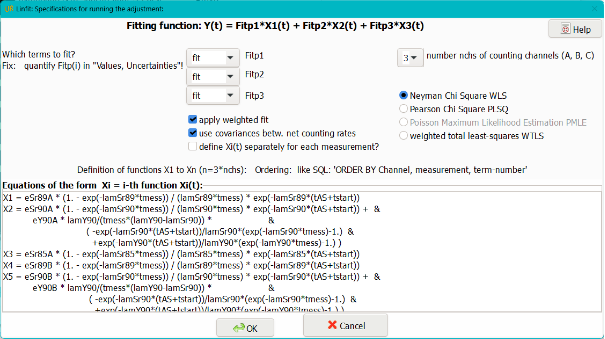
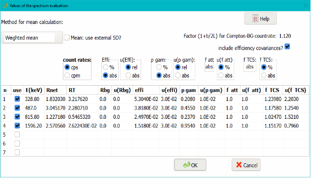

# Summary

<!-- # Statement of need

`UncertRadio` is an

`UncertRadio` was designt -->

# Introduction

In the field of environmental radioactivity, evaluations of the output quantities of the
measurement of radionuclide activity concentrations, and estimating associated uncertainties,
are based on the ISO GUM [@jointcommitteeforguidesinmetrology2008]. The variety of such determinations or
measurements, and consequently of evaluation methods, is quite large. The standard @dindeutschesinstitutfurnormunge.v.2021 series, consisting of four parts, extends this Guide by methods for deriving the decision
threshold (DT), the detection limits (DL) and limits of coverage intervals.
It has been demonstrated earlier how a generalized evaluation of a large variety of environmental
radioactivity measurements, without and with using linear unfolding (weighted least squares),
can be performed with a single program, UncertRadio [@kanisch2016a;@kanisch2016b]. A set of equations
describing the measurement evaluation model, supplied by the user at run-time, are made available
for calculations by using a function parser named fparser. Fparser is available as Fortran
open source code [@schmehl2008]. It has functions for analyzing the formulae (parsef) and
for calculating their values (evalf).
For ISO GUM compatible uncertainty propagation, such numerical calculations include also calculating
partial derivatives approximated by difference quotients; they need not be supplied by the user,
which avoids possible user mistakes. The evaluation within UR is extended to include ISO 11929
decision thresholds and detection limits. As an alternative to numerical uncertainty propagation,
the „propagation of distributions“ of input variables with Monte Carlo (MC) simulation is included.

# Available information about UncertRadio

In a publication Part I [@kanisch2016a], an overview considering evaluations without using
linear unfolding is presented. A way is shown of how to further formalize the equations necessary
for the evaluation of the output quantity. Apart from a set of equations by which the value
of the output quantity can be described, fulfilling few assumptions is sufficient to solve
all the necessary tasks:

i.   The sum a detection dependent background count rate $R_0$ and, if applicable, an interference
     count rate $R_{(BI)}$ is subtracted. So, there is a linear dependency between $R_n$ and a
     gross counting rate $R_g$;
ii.	 The dependency between the output quantity $y$ (activity concentration) and $R_n$ is also
     linear, $y=F_C + F_L \cdot R_n$;
iii. The uncertainty of the gross counting rate $R_g$ can be expressed by a simple formula, in
     most cases simply as $u(R_g)=\sqrt((R_g /t_m))$ with a counting duration $t_m$.
     The gross count rate is the only one containing the contribution by the radionuclide
     activity which is to be measured.

$F_C$ usually is zero, but it may become negative in few special cases. The proportionality
factor $F_L$ represents a procedure-dependent calibration factor, i.e., the quantity $w$ used in
@dindeutschesinstitutfurnormunge.v.2021 . The symbols associated with the
net counting rate and the gross count rate need to be identified by the user in a program dialog.
Deriving values of decision threshold or detection limit requires finding other
values $\tilde R_n$ from given, or modified, values $\tilde y$ of the output quantity,
where \~ denotes such
modified values. The decision threshold, denoted by $y^*$, as an example, requires finding
the uncertainty $u(\tilde y=0)$ for the modified output quantity value $\tilde y=0$. The above-mentioned linear
relations allow to find the associated $\tilde R_g$ for which the uncertainty value is
$u(\tilde R_g)=\sqrt(\tilde R_g/t_m)$.
Re-starting the uncertainty calculation now from the
pair $\tilde R_g$ and $u(\tilde R_g)$ leads to the uncertainty $u(\tilde y=0)$ and thereby to the decision threshold
$y^* = k_(1-α) \cdot u(\tilde y=0)$. The detection limit, denoted by $y^\#$, is obtained by iteration from
the implicit relation $y^\# =y^* +k_(1-\beta) \cdot u(y^\#)$.

In the publication Part II [@kanisch2016b] the extension of the method to such evaluation
models is described which require a weighted linear least-squares method (WLS) for a part
of the evaluation model. Now, there is a series of time-dependent measured net count rates
from the sample preparation available, which in most cases form a decay curve or a build-up
curve. Theoretical functions of such curves are defined from the Bateman equations for
radioactive decay of single radionuclides or of decay-chains of two radionuclides, like e.g.
the parent-daughter pair Sr-90, Y-90, encountered in the radiochemistry of Strontium isotopes.
In the present version of UncertRadio, up to three radionuclides are allowed for contributing
to the decay curve. A weighted least-squares fit of the function to the decay-curve is applied.
The $k (k=1,2 or 3)$ fitted parameters represent count rate values $R_{(n,k)} (t=0)$ defined for a
specific point of time t=0; the latter often is the time of a specific radiochemical separation
step. The values $R_{(n,k)} (t=0)$ and their uncertainties, also obtained from the fit, define
the first stage of the overall evaluation. In the second evaluation stage, these net count
rates are converted to activities or activity concentrations for the time of sampling by
applying procedure-dependent calibration factors including necessary corrections for radioactive
decay.

The WLS step is performed by matrix-algebra. Basically, it is described by a matrix equation $x = Ay$.
Herein, x and y are the vectors of the measured net count rates (number $n_x$) and of the fitting
parameters (number $n_y <= 3$). The "design matrix" A contains the different decay correction
functions. The elements of A may include parameters with uncertainties, e.\,g. half-lives or chemical
yields. These require further uncertainty propagation steps, also formulated in matrix notation.
The uncertainties of x form the diagonal elements of a covariance matrix $U_x$. Depending on the
measurement conditions, $U_x$ may also contain covariances, i.\,e. non-diagonal elements.

{width=99%}

{width=99%}

<!-- # Mathematics

Single dollars ($) are required for inline mathematics e.g. $f(x) = e^{\pi/x}$

Double dollars make self-standing equations:

$$\Theta(x) = \left\{\begin{array}{l}
0\textrm{if} x < 0\cr
1\textrm{else}
\end{array}\right.$$

You can also use plain \LaTeX for equations
\begin{equation}\label{eq:fourier}
\hat f(\omega) = \int_{-\infty}^{\infty} f(x) e^{i\omega x} dx
\end{equation}
and refer to \autoref{eq:fourier} from text. -->

<!-- # Citations

Citations to entries in paper.bib should be in
[rMarkdown](http://rmarkdown.rstudio.com/authoring_bibliographies_and_citations.html)
format.

If you want to cite a software repository URL (e.g. something on GitHub without a preferred
citation) then you can do it with the example BibTeX entry below for @fidgit.

For a quick reference, the following citation commands can be used:
- `@kanisch2016`  ->  "Author et al. (2001)"
- `[@kanisch2016]` -> "(Author et al., 2001)"
- `[@kanisch2016; @kanisch2017]` -> "(Author1 et al., 2001; Author2 et al., 2002)" -->

<!-- # Figures

Figures can be included like this:

and referenced from text using \autoref{fig:example}.

Figure sizes can be customized by adding an optional second parameter:
{ width=20% } -->

# Acknowledgements

# References
